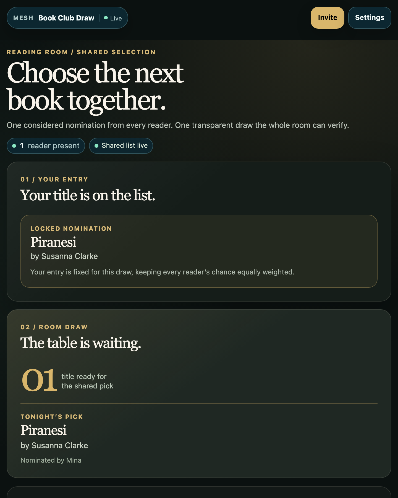
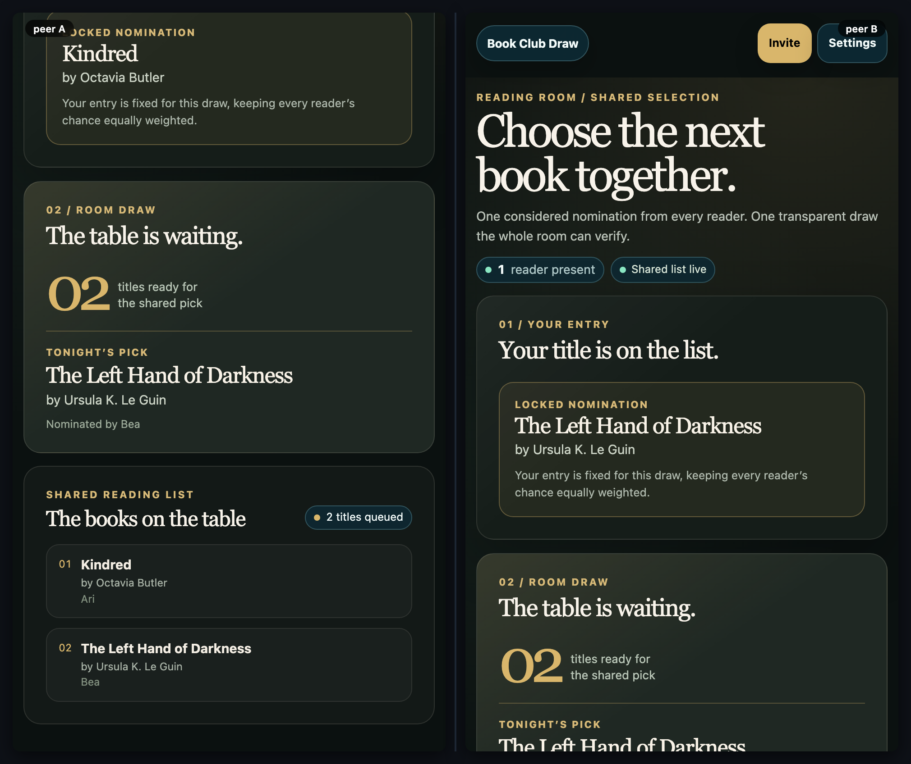
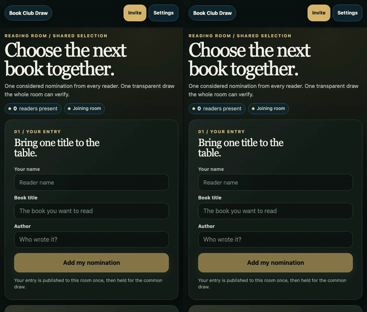

# Book Club Draw

[](https://baditaflorin.github.io/mesh-book-club-lottery/)
[](https://github.com/baditaflorin/mesh-book-club-lottery/blob/main/package.json)
[](./LICENSE)

> A quiet, shared reading-room draw: every reader puts forward one title, and every device sees the same reproducible pick.

**Live:** https://baditaflorin.github.io/mesh-book-club-lottery/

**Source:** https://github.com/baditaflorin/mesh-book-club-lottery



## What it does

Book Club Draw is a rootless peer-to-peer browser app for deciding the next club read without a host or a hidden server-side lottery.

- Each reader can add exactly one validated book and author to a shared list.
- The common pick is computed from the same sorted nominations on every device, so the result is inspectable and reproducible.
- A reveal made by any reader is shared with the room; the winning title and its nominator are visible to everyone.
- The room runs directly through the Mesh Common WebRTC/Yjs layer. There is no application database or app-owned backend.



## Use it in a reading group

1. Open the live app and use **Invite** in the top bar to share the same room with the group.
2. Each person enters a name, a book title, and an author, then selects **Add my nomination**.
3. When the list is ready, anyone selects **Reveal the room’s pick**. Every connected reader sees the same result.

One entry is locked after submission so a single device cannot inflate its odds. The room URL is the access boundary: only share it with people who should see the nominations.

## Development

`mesh-common` must sit beside this repository because the app consumes it through `file:../mesh-common`.

```bash
git clone https://github.com/baditaflorin/mesh-common
git clone https://github.com/baditaflorin/mesh-book-club-lottery
cd mesh-common && npm ci
cd ../mesh-book-club-lottery && npm ci
npm run dev
```

The important local checks are:

```bash
npm run fmt:check
npm run typecheck
npm run test:unit
npm run smoke
npm run test:e2e
MESH_RUN_LEAK_TEST=1 MESH_LEAK_DURATION_MS=5000 npm run test:e2e -- --workers=1
bash ../mesh-common/scripts/audit-app-security.sh
```

The E2E suite includes a two-reader nomination and reveal flow plus first-viewport contracts at 390 × 844 and 1141 × 602.

## Release assets and deployment

GitHub Pages serves the committed `docs/` directory from `main`. Woodpecker validates formatting, static types, tests, and the Pages build using a sibling checkout of Mesh Common.

```bash
npm run build
bash ../mesh-common/scripts/screenshot-app.sh
bash ../mesh-common/scripts/record-demo.sh
```

The release bundle includes a single-device product screenshot, a two-reader preview, and a short recorded draw:



## Privacy and infrastructure

Nominations, reader names, and revealed results are visible to peers in the same room. The signaling service helps peers find one another; TURN is used only when a direct peer connection cannot be made. See [the full privacy model](docs/privacy.md) for the data boundaries and limitations.

## License

MIT — see [LICENSE](./LICENSE).
